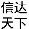
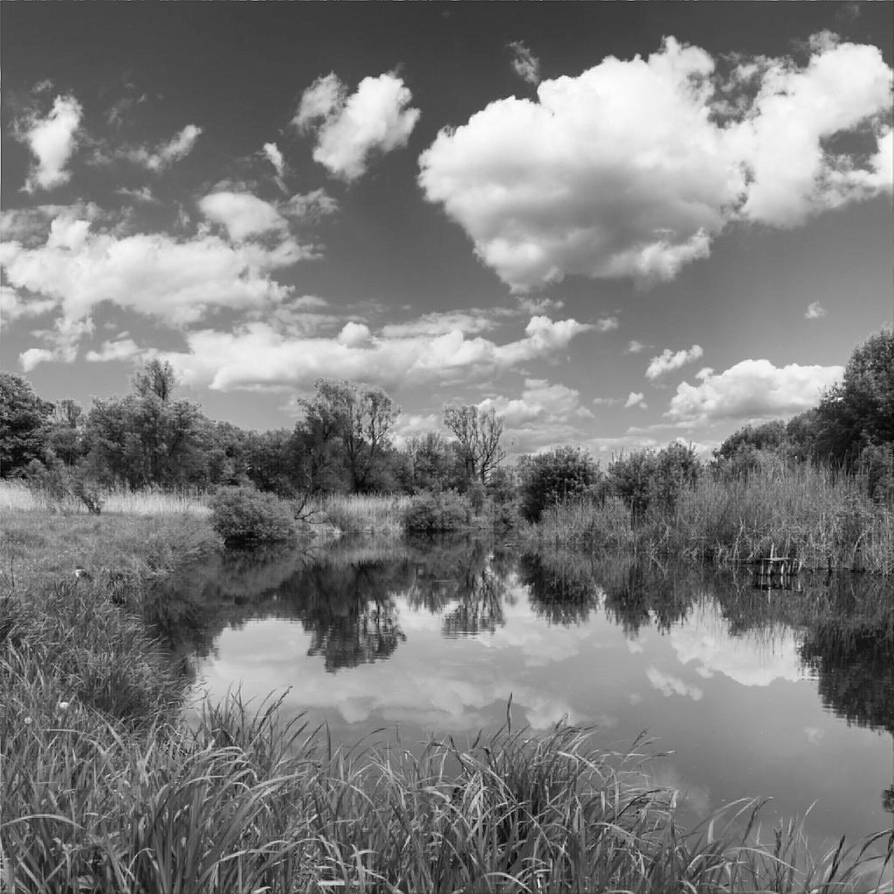

# Code
#### 文件说明
1. steganalysis隐写分析
2. steganography隐写算法

#### 隐写算法
1. 秘密信息：不论格式、编码，最终是一串比特流010101...
2. 载体：RGB图像、灰度图像
3. 密钥：编码格式、嵌入方式、嵌入位置等都算隐写算法的密钥
- 本科毕设：基于边缘检测度量变化的图像隐写
    1. 秘密信息：二值图像（黑白图像）转换为比特流
    2. 载体：灰度图像
    3. 密钥：使用GHM多小波分解载体，嵌入位置由边缘检测低频区域的差值决定
    4. 使用方式：下载steganography下的所有.m文件，country是一张载体图片  
        info1 和 info2 是两张宽相等，长度不相等的秘密图像，嵌入后会生成Secret.png文件  
        之后再选择tiqu.m选择Secret.png文件就可以看到提取后的，其中代码将宽度设置为密钥，程序中已写。  
        载体图像：  
        秘密信息：
        含密图像：
    5. 本科所作的毕设demo很多细节处理的不好，诸如将彩色图转换为灰度图最后没转回来，显然这个文件名就有问题，而且当时虽然有gui，但是需要matlab环境，所以就不放了，算是一个复杂图像隐写算法的练习

#### 三维模型隐写分析介绍
1. 3d mesh steganalysis 代码包含两个模块1）提取特征2）机器学习
2. 提取特征：通过matlaba处理.off文件，输出特征集csv
3. 机器学习：通过python+scikit+pandas+numpy处理特征集

#### 数据集说明  
1. PSB普林斯顿分割集，真实世界扫描得来。  
2. 包含20类，共计400个，其中261-280这20个人体模型存在网格问题，所以我们实验一般用380个  

#### 3D隐写分析相关论文及介绍（按照研究逻辑的时间顺序）
1. Ying Yang and Ioannis Ivrissimtzis, “Mesh discriminative features for 3D steganalysis,” ACM Transactions on Multimedia Computing, Communications, and Applications, vol. 10, no. 3, pp. 27:1–27:13, 2014.        特征集YANG208
2.  Z. Li, A.G. Bors, 3D mesh steganalysis using local shape features, in: Proceedings of IEEE International Conference on Acoustics, Speech and Signal Processing (ICASSP), 2016, pp. 2144–2148.       使用局部形状特征的3D网格隐写分析    特征集LFS52

#### 数字图像隐写分析常用数据集  
1. BOSSBase (BOWS2):
BOSSBase (Break Our Steganographic System) is a widely used dataset for image steganalysis.  
It consists of 10,000 grayscale images in BMP format, with a resolution of 512x512 pixels.  
2. BOWS2: BOWS2 (Break Our Watermarking System) is another dataset commonly used in steganalysis research.  
It contains 10,000 grayscale images in BMP format, with a resolution of 512x512 pixels.  
3. S-UNIWARD: S-UNIWARD is a dataset specifically designed for steganalysis of spatial domain image steganography algorithms.  
It consists of 50,000 grayscale images in BMP format, with a resolution of 512x512 pixels.  
4. HUGO: HUGO is a dataset created for steganalysis of JPEG steganography algorithms.   
It contains 50,000 color images in JPEG format, with a resolution of 512x512 pixels.

